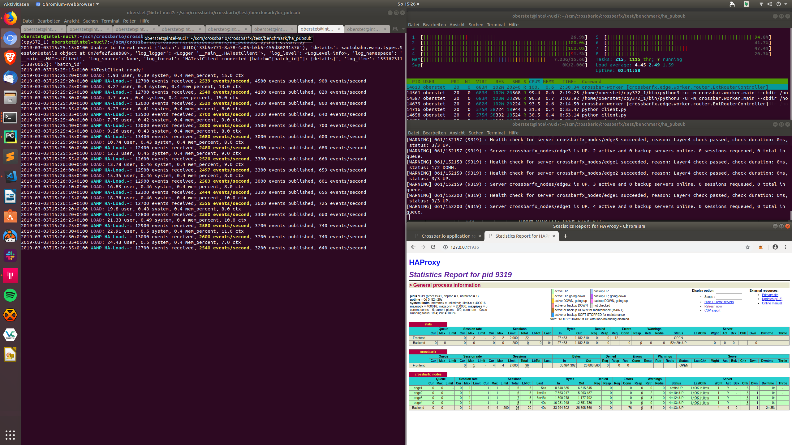
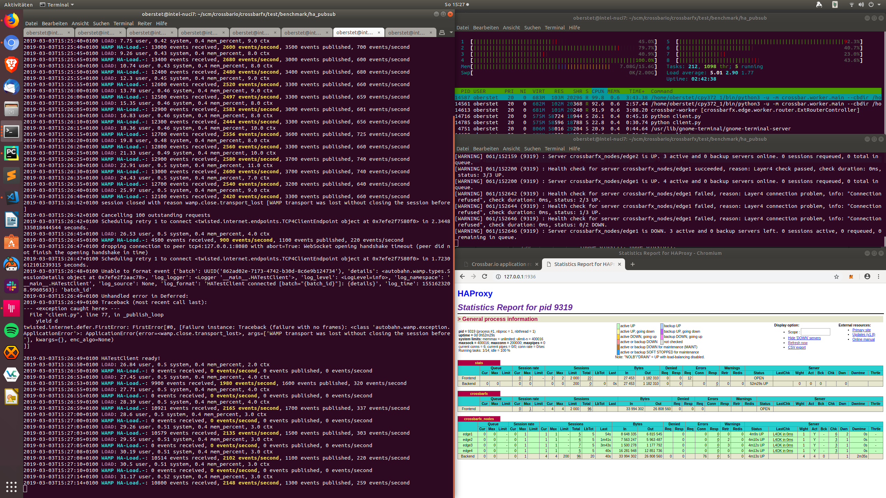
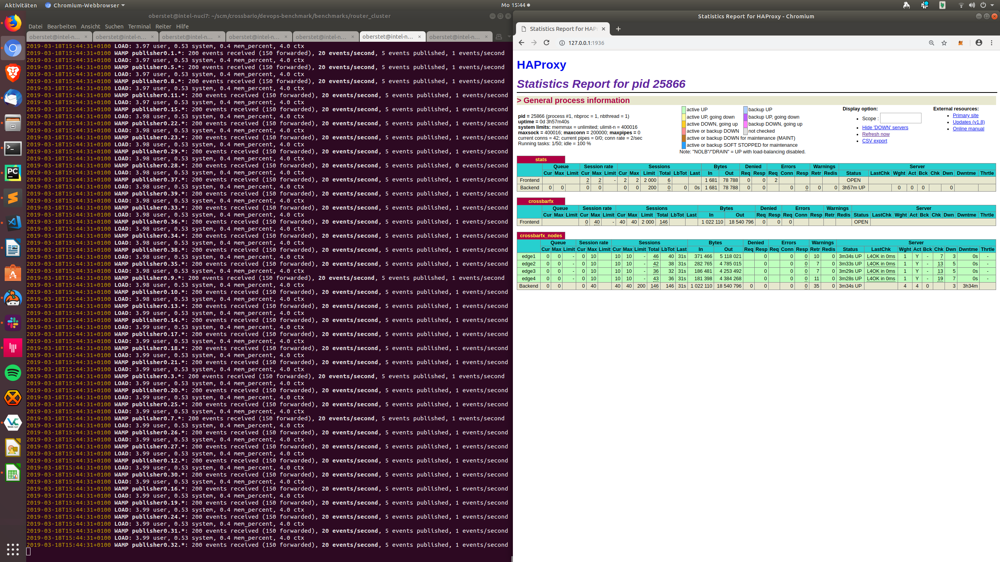
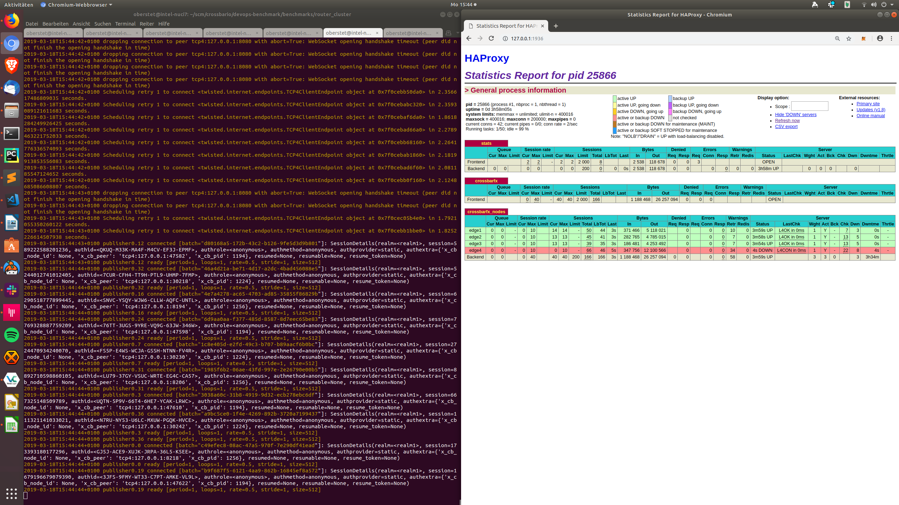

# CrossbarFX HA test







python main.py --silent --duration 300 --period 10 --clients 8 --connections 40 --loops 1 --rate 2 --stride 1 --size 128
=> 400Mb/sec, 200k events/sec

python main.py --silent --duration 300 --period 10 --clients 8 --connections 32 --loops 1 --rate 10 --stride 1 --size 512


632Mb

>>>> 8*32
256
>>>> 8*32*10
2560
>>>> 8*32*10*256
655360
>>>> 8*32*10*256*512
335544320
>>>> 8*32*10*256*512/1024/1024
320.0
>>>> 


python main.py --silent --duration 60 --period 10 --clients 8 --connections 16 --loops 1 --rate 5 --stride 1 --size 4096
python main.py --silent --duration 60 --period 10 --clients 8 --connections 16 --loops 1 --rate 1 --stride 8 --size 4096
python main.py --silent --duration 120 --period 10 --clients 8 --connections 32 --loops 1 --rate 4 --stride 1 --size 128


```
(pypy3_1) oberstet@intel-nuci7:~/scm/crossbario/crossbarfx/test/benchmark/router_cluster$ python main.py --duration 5 --period 1 --clients 1 --connections 1 --loops 1 --rate 1 --stride 1 --size 512
Client with PID 24286 starting ..
Started clients with PIDs [24288]
Client with PID 24288 starting ..
2019-03-05T19:57:09+0100 publisher0.0 connected [batch="78fbc10a-2a55-421e-b677-19140677ae37"]: SessionDetails(realm=<realm1>, session=2306096914579341, authid=<M9HL-79YM-QGWP-4X37-P395-Y5EW>, authrole=<anonymous>, authmethod=anonymous, authprovider=static, authextra={'x_cb_node_id': None, 'x_cb_peer': 'tcp4:127.0.0.1:1372', 'x_cb_pid': 20404}, resumed=None, resumable=None, resume_token=None)
2019-03-05T19:57:09+0100 publisher0.0 ready [period=1, loops=1, rate=1, stride=1, size=512, logname=publisher0.0]
2019-03-05T19:57:10+0100 LOAD: 1.24 user, 0.55 system, 0.9 mem_percent, 3.0 ctx
2019-03-05T19:57:10+0100 WAMP publisher0.0.*: 1 events received (0 forwarded), 1 events/second, 1 events published, 1 events/second
2019-03-05T19:57:11+0100 LOAD: 1.25 user, 0.55 system, 0.9 mem_percent, 3.0 ctx
2019-03-05T19:57:11+0100 WAMP publisher0.0.*: 1 events received (0 forwarded), 1 events/second, 1 events published, 1 events/second
2019-03-05T19:57:12+0100 LOAD: 1.26 user, 0.55 system, 0.9 mem_percent, 3.0 ctx
2019-03-05T19:57:12+0100 WAMP publisher0.0.*: 1 events received (0 forwarded), 1 events/second, 1 events published, 1 events/second
2019-03-05T19:57:13+0100 LOAD: 1.26 user, 0.55 system, 0.9 mem_percent, 3.0 ctx
2019-03-05T19:57:13+0100 WAMP publisher0.0.*: 1 events received (0 forwarded), 1 events/second, 1 events published, 1 events/second
2019-03-05T19:57:14+0100 publisher0.0 leaving: reason="wamp.close.transport_lost"
2019-03-05T19:57:14+0100 Main loop terminated.
```

---

# BPF

```
sudo bpftrace syscount.bt
```

* [Full-system dynamic tracing on Linux using eBPF and bpftrace](https://www.joyfulbikeshedding.com/blog/2019-01-31-full-system-dynamic-tracing-on-linux-using-ebpf-and-bpftrace.html)
* [Linux System Call Table for x86 64](http://blog.rchapman.org/posts/Linux_System_Call_Table_for_x86_64/)


## Test configuration

Tested is a configuration:

* 4 CrossbarFX edge nodes, connected to 1 CrossbarFX master node
* 2 edge nodes on each of `brummer1` and `brummer2`, the master node on `matterhorn`
* each edge node runs 1 router worker with a realm `realm1`
* all 4 router workers are connecting to each other (in a full mesh) for realm `realm1`
* the 4 router workers run a TCP-WebSocket-CBOR listening transport on `0.0.0.0:8081 - 0.0.0.0:8084`
* HAproxy runs on `matterhorn`, listening on TCP `*:8080` and forwarding to above 4 router workers (at layer 4, that is raw TCP)

The test probe runs on `matterhorn`, connecting to HAproxy at `localhost:8080` which will forward the
connection to one of the 4 router workers of the 2 nodes running on each of `brummer1` and `brummer2`.

When one of the 4 edge nodes dies, 25% of client connections will reconnect (to HAproxy) and be forwarded
to one of the 3 remaining edge nodes (the router worker of that node).

When one of the 2 boxes running edge nodes dies, 50% of client connections will reconnect and be forwarded
to one of the 2 remaining edge nodes on the surviving box.

When an edge node comes back, HAproxy will (after a short time) recognize and _new_ client connections will
be directed to the edge node that came back.

HAproxy using a "least connections" load-balancing strategy will over time again spread connections evenly
accross nodes.

> Note: it is possible of course to kill client connections, forcing them to reconnect, to speeden up the re-balancing of connections after recovery from failed nodes (or boxes).


## Increasing the FD limits

> Note: this expands on what is described in our docs in [Network Tuning](https://crossbar.io/docs/Network-Tuning/)

Modify `/etc/systemd/user.conf` and `/etc/systemd/system.conf` with the following line (this takes care of graphical login):

```console
DefaultLimitNOFILE=1048576
```

Modify `/etc/security/limits.conf` with the following lines (this takes care of non-GUI login):

```
# wildcard does not work for root, but for all other users
*               soft     nofile           1048576
*               hard     nofile           1048576
# settings should also apply to root
root            soft     nofile           1048576
root            hard     nofile           1048576
```

Modify `/etc/pam.d/common-session` and `/etc/pam.d/common-session-noninteractive` with the following line:

```
session required pam_limits.so
```

Reboot the system. You should get:

```
oberstet@intel-nuci7:~$ cat /proc/sys/fs/file-max 
16777216
oberstet@intel-nuci7:~$ ulimit -n
1048576
oberstet@intel-nuci7:~$ ulimit -Hn
1048576
```


---

https://kb.novaordis.com/index.php/HAProxy_Configuration


- use struss/dtrace to measure crossbarfx
- setup haproxy

---

polling FDs on Linux 4.18+ without doing syscalls

IOCB_CMD_POLL

https://lwn.net/Articles/742978/

https://blog.cloudflare.com/io_submit-the-epoll-alternative-youve-never-heard-about/

----

subclass and override this method, getting rid
of this syscall (epoll_wait):

https://github.com/twisted/twisted/blob/c20f01967702c6941ca796cc4837791754944c1c/src/twisted/internet/epollreactor.py#L218

replace with this code that directly taps into
the ring buffer with the completions, including
our polled sockets:

https://github.com/cloudflare/cloudflare-blog/blob/930dbeaebe8df3ba169597a80de458e44f47efc3/2019-01-io-submit/aio_poll.c#L63

note that the syscalls to actually read/write from/to the sockets will still occur:

https://github.com/twisted/twisted/blob/c20f01967702c6941ca796cc4837791754944c1c/src/twisted/internet/epollreactor.py#L229

there is no "vectored IO on TCP sockets API" in linux as far as I know ..

----

https://blog.cloudflare.com/why-we-use-the-linux-kernels-tcp-stack/

https://github.com/cloudflare/cloudflare-blog/blob/master/2019-01-io-submit/aio_poll.c

https://linux.die.net/man/2/io_submit
https://linux.die.net/man/2/io_getevents

https://unix.stackexchange.com/questions/447249/linux-aio-io-submit-io-getevents-on-fifo-named-pipes

http://seastar.io/
https://github.com/scylladb/seastar
http://docs.seastar.io/master/classseastar_1_1future.html


https://github.com/mtcp-stack/mtcp


twisted.internet.kqreactor.doKEvent

calls

twisted.internet.tcp.Connection.doRead

calls

twisted.internet.protocol.dataReceived


https://github.com/twisted/twisted/blob/c20f01967702c6941ca796cc4837791754944c1c/src/twisted/internet/tcp.py#L227

https://github.com/twisted/twisted/blob/c20f01967702c6941ca796cc4837791754944c1c/src/twisted/internet/kqreactor.py#L293
